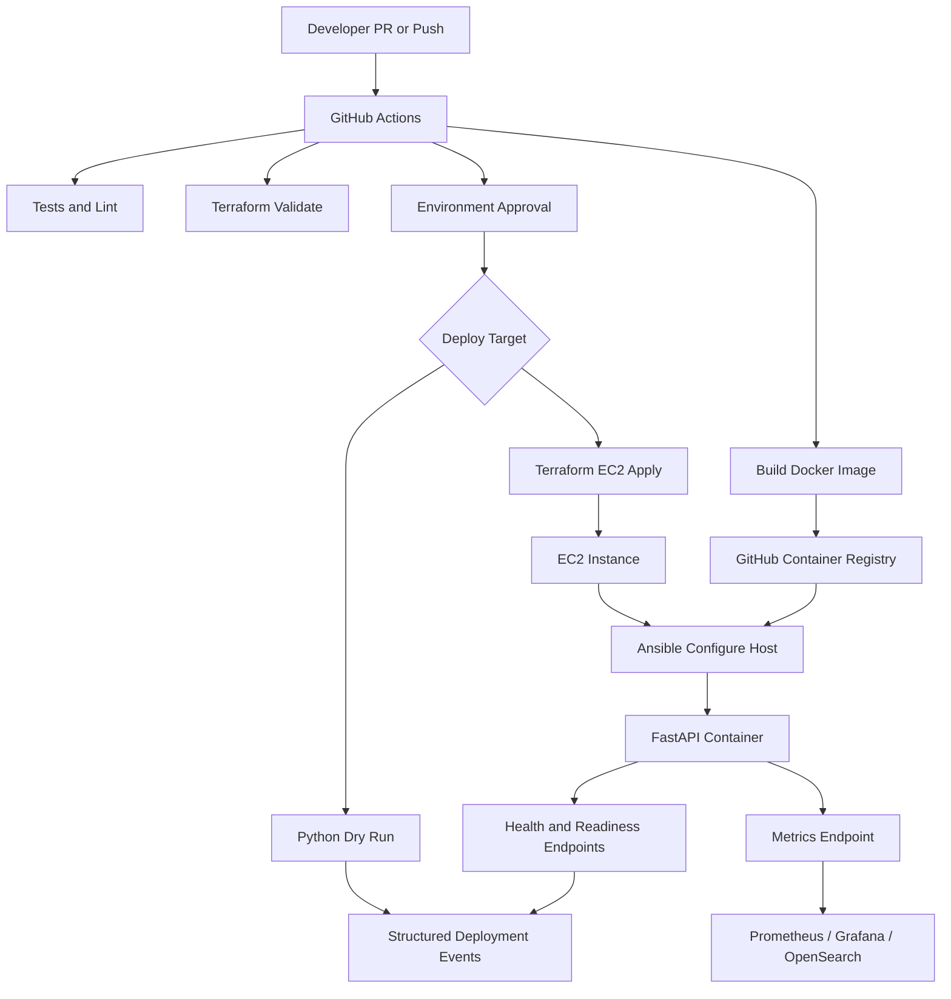

# SRE Automation Demo

I will keep this focused on the end-to-end design: how I provision infrastructure, build the application, deploy it, validate it, and make the workflow observable.

## Project Overview

I built this as a practical SRE automation example for deploying a containerized Python service onto AWS infrastructure.

I separated the responsibilities by tool:

- Terraform manages infrastructure state.
- Python coordinates deployment workflow, validation, retries, logs, metrics, and rollback.
- Ansible configures the EC2 host and runs the application container.
- Docker packages the FastAPI service.
- GitHub Actions provides the controlled path from commit to deployment.

The goal is repeatable, observable infrastructure and application deployment, with a safe dry-run path and a real EC2 deployment path.

## Architecture



The artifact flow is:

```text
FastAPI app -> Docker image -> GHCR -> EC2 -> Ansible rollout -> health check
```

The environment flow is:

```text
dev -> staging -> prod
same image tag, different config and infrastructure variables
```

## Codebase Structure

I focus on these files because they show the main engineering decisions:

- `app/main.py`: FastAPI app with `/health`, `/ready`, `/metrics`, and sample order endpoint.
- `app/Dockerfile`: container packaging.
- `src/sre_automation/deploy.py`: Python deployment orchestration.
- `src/sre_automation/terraform.py`: Terraform wrapper with retries, dry-run, and timing metrics.
- `src/sre_automation/secrets.py`: validates secret references without exposing values.
- `terraform/modules/ec2_app/main.tf`: EC2, security group, IAM instance profile, encrypted root volume.
- `ansible/playbooks/deploy_app.yml`: installs Docker, pulls the image, runs the container, validates `/health`.
- `.github/workflows/ci.yml`: test, build, validate, dry-run deploy, and EC2 deploy flow.

## Python-Driven SRE Automation

Python is the workflow layer. Terraform remains the source of truth for infrastructure.

The deployment path I am modeling is:

```text
sre-deploy deploy
  -> load YAML config
  -> validate secret references
  -> terraform init/plan/apply
  -> roll out artifact
  -> smoke check
  -> health validation
  -> rollback on failure
```

Python adds the operational behavior around Terraform:

- typed config loading
- dry-run mode
- retries around command execution
- structured deployment events
- duration metrics
- rollback hook
- a consistent CLI for operators and CI/CD

## CI/CD

The GitHub Actions workflow has four main jobs:

- `python`: install dependencies, run `ruff`, run tests.
- `container`: build the FastAPI Docker image and push to GHCR when needed.
- `terraform`: validate both the safe local Terraform env and the AWS EC2 env.
- `deploy-dry-run` / `deploy-aws-ec2`: either run the orchestrator safely or provision EC2 and deploy with Ansible.

For a real EC2 deploy, I pass the required cloud and SSH inputs through GitHub Actions:

- `AWS_ROLE_TO_ASSUME`
- `EC2_SSH_PRIVATE_KEY`
- `ami_id`, `key_name`, region, instance type, and SSH CIDR workflow inputs

If I were hardening this for production, I would add:

- Terraform plan artifacts on PRs
- Checkov or tfsec policy checks
- SBOM and image vulnerability scanning
- stricter environment approvals
- remote state with locking for every shared environment

## Secrets, Config, And Promotion

The repo uses secret references, not raw secrets:

```yaml
secret_refs:
  db_password: aws-secretsmanager://prod/orders-api/db_password
  api_token: vault://kv/prod/orders-api/api_token
```

The image is built once and promoted by tag. That avoids rebuilding different artifacts for each environment and makes rollback much clearer.

## Observability And Rollback

The automation emits structured events:

- `deployment_started`
- `command_started`
- `metric`
- `smoke_check_completed`
- `service_health_validated`
- `rollback_started`

The app exposes simple operational endpoints:

- `/health`
- `/ready`
- `/metrics`

In production I would send logs to OpenSearch or Loki, scrape metrics with Prometheus or OpenTelemetry, and use Grafana dashboards. I would alert on user-impacting signals: failed deploys, rollback failures, 5xx rate, latency SLOs, queue age, and error-budget burn.

Rollback is modeled as a deployment phase, not an improvised incident command. The automation records the previous image tag, emits rollback events, and would re-run health checks after restoration.

## Generative AI For SRE

I would use AI to reduce toil and cognitive load:

- summarize incidents from alerts, logs, deploy history, and chat timelines
- retrieve relevant runbook sections
- draft postmortems from verified facts
- generate tests for Python automation
- explain Terraform plans during review
- identify noisy alerts and suggest tuning
- provide read-only ChatOps support

The guardrails are important:

- read-only by default
- no secrets in prompts
- RBAC and audit logs
- human approval for destructive actions
- generated code still goes through tests, scans, and review

AI should speed up investigation and routine work. It should not bypass operational controls.

## Insider Risk Evaluation

I define insider risk as harm caused by trusted users or compromised trusted identities misusing or mishandling authorized access.

That includes malicious insiders, negligent users, compromised accounts, privilege misuse, data exfiltration, policy bypass, and risky behavior around sensitive systems or data.

When evaluating an insider-risk platform, I look for:

- detection quality across malicious, negligent, and compromised-user scenarios
- peer-group baselining and behavioral analytics
- explainable risk scoring
- low false-positive burden
- endpoint, cloud, SaaS, server, and privileged-account visibility
- privacy controls such as role-based access, pseudonymization, minimization, and audit trails
- SIEM, SOAR, ticketing, and identity-provider integrations
- scalability and endpoint performance

The tool needs to produce explainable, prioritized, privacy-aware signals. Detecting events is not enough if analysts cannot trust or act on the results.

## Summary

The design uses each tool at the right layer:

- Terraform for desired infrastructure state.
- Python for safe deployment orchestration.
- Ansible for repeatable host configuration.
- Docker for portable application packaging.
- GitHub Actions for controlled delivery.

This gives me an end-to-end infrastructure and application deployment model with validation, observability, rollback hooks, and a clear path to production hardening.
