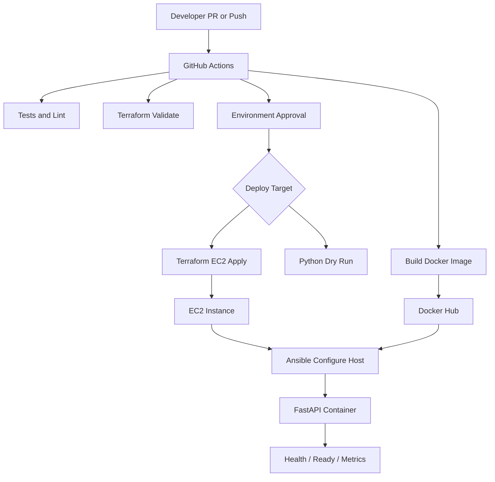

# SRE Automation Demo

## What I Built

I built a small end-to-end SRE automation demo that provisions infrastructure, builds a Python application, deploys it as a container, and validates health.

The goal is not just to show code. The goal is to show how I think about safe, repeatable, observable infrastructure and application delivery.

Core flow:

```text
FastAPI app -> Docker image -> Docker Hub -> EC2 -> Ansible rollout -> health check
```

---

## Architecture



The architecture separates deterministic automation from workflow orchestration.

---

## Why This Stack

| Need | Tool | Reason |
|---|---|---|
| Infrastructure state | Terraform | declarative, reviewable, plan/apply, drift detection |
| Workflow orchestration | Python | validation, retries, API integration, AI hooks |
| Host configuration | Ansible | repeatable EC2 setup, readable operational model |
| App packaging | Docker | immutable artifact promotion |
| CI/CD | GitHub Actions | approvals, OIDC, audit trail |
| Registry | Docker Hub | simple portable container distribution |

I use each tool at the layer where it is strongest.

---

## Python-Driven SRE Automation

Python is the workflow layer. Terraform remains the source of truth for infrastructure.

The orchestrator handles:

- typed environment config
- secret reference validation
- Terraform command execution
- retries and dry-run mode
- structured logs and timing metrics
- smoke checks and rollback hooks

```text
sre-deploy deploy
  -> load config
  -> validate secrets
  -> terraform plan/apply
  -> deploy artifact
  -> validate health
  -> rollback on failure
```

---

## Infrastructure And Application Deployment

The repo demonstrates both infrastructure and application delivery.

Infrastructure:

- EC2 instance
- security group
- IAM role and instance profile
- encrypted root volume
- Terraform environment roots

Application:

- FastAPI service
- Dockerfile
- Docker Hub image
- Ansible container rollout
- `/health`, `/ready`, and `/metrics`

---

## CI/CD And Promotion

GitHub Actions provides the controlled path from commit to deployment.

Pipeline stages:

- run Python tests and linting
- build the Docker image
- push to Docker Hub when needed
- validate Terraform
- run safe dry-run deployment or real EC2 deployment

Promotion model:

```text
dev -> staging -> prod
same image tag, different config and infrastructure variables
```

This makes rollback clearer because the artifact is immutable.

---

## Secrets, Observability, And Rollback

Secrets are referenced, not stored:

```yaml
secret_refs:
  db_password: aws-secretsmanager://prod/orders-api/db_password
  api_token: vault://kv/prod/orders-api/api_token
```

Observability signals:

- structured deployment events
- command duration metrics
- application health and readiness
- Prometheus-style `/metrics`

Rollback is treated as a deployment phase, not an improvised incident command.

---

## Where AI Fits In SRE

I would use AI to reduce toil and cognitive load, not to bypass controls.

Useful AI workflows:

- summarize incidents from alerts, logs, deploys, and chat
- answer “what changed?” after an alert
- retrieve runbook sections
- explain Terraform plans
- generate test cases for automation
- draft postmortems from verified facts
- identify noisy alerts and suggest tuning

AI is most useful when it gathers context and calls deterministic automation behind approval gates.

---

## AI Guardrails

The AI layer should be constrained.

Guardrails:

- read-only by default
- no secrets in prompts
- RBAC and audit logs
- human approval for production mutation
- policy-as-code checks
- generated code still goes through tests and review
- recommendations include evidence and confidence

The operating model:

```text
AI gathers context -> AI recommends -> human approves -> automation executes
```

---

## Insider Risk Evaluation

I define insider risk as harm caused by trusted users or compromised trusted identities misusing or mishandling authorized access.

When evaluating an insider-risk platform, I look for:

- malicious, negligent, and compromised-user detection
- peer-group baselining and behavioral analytics
- explainable risk scoring
- low false-positive burden
- endpoint, cloud, SaaS, server, and privileged-account visibility
- privacy controls and investigator audit trails
- SIEM, SOAR, ticketing, and identity-provider integrations

The tool needs to produce explainable, prioritized, privacy-aware signals that analysts can trust and act on.
